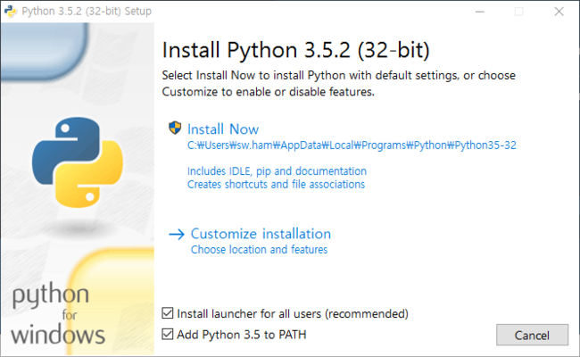

HighColl.py 다운로드: https://drive.google.com/file/d/1Az05rd0SJxpWrgMP-harP9euRnHKy88Z/view?usp=sharing   
파이썬 다운로드: https://www.python.org/downloads/release/python-382/   
   
**체크박스 2개다 체크**

윈도우 검색에서 명령 프롬프트 검색후 실행      
- **pip install bs4 입력**   
- **pip install selenium 입력**   
- **pip install moviepy 입력**   

크롬 버전 확인: chrome://version/ (주소창에 입력)   
크롬 드라이버 다운로드: http://chromedriver.storage.googleapis.com/index.html
